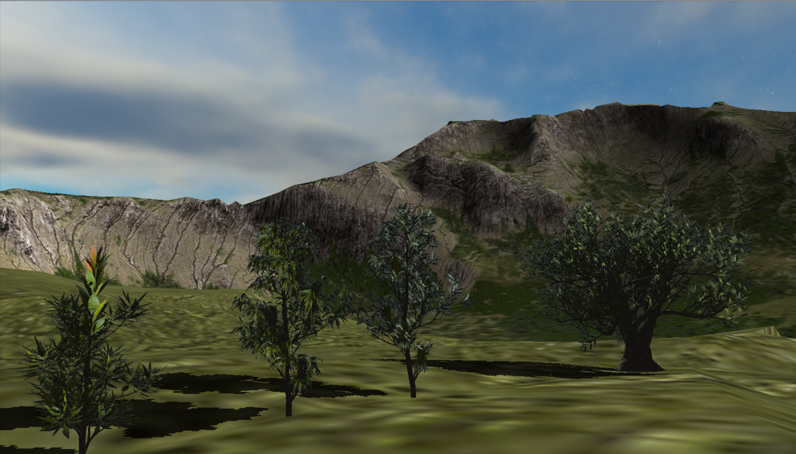
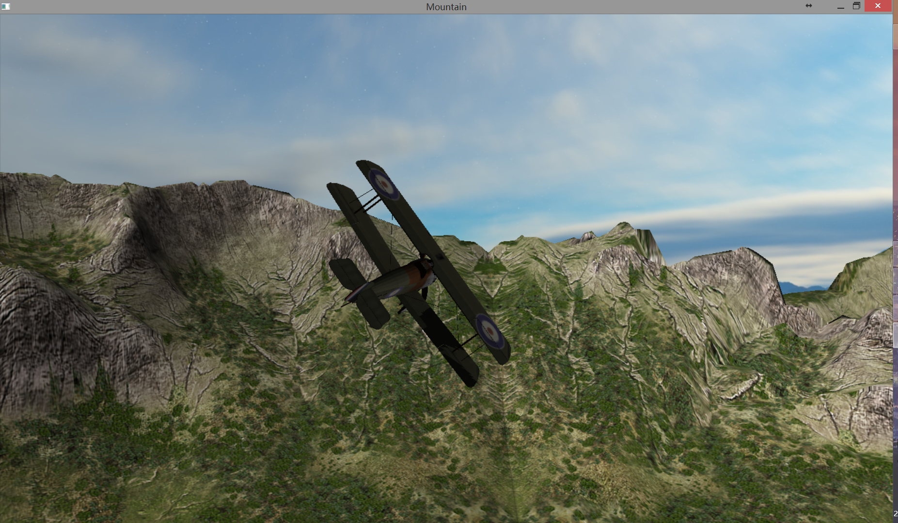

### Running Requirements
    including but not limited to belowing
- Microsoft visual studio 2015 **x86** **Release**
- openGL version 3.30 or above

### technique overview
- multi-frustum 
- cascade shadow map
- alpha test
- skybox
- collision detect

### files
- assets : model
- shaders : GLSL codes
- dep : dependent lib

### design overview
- **main**
    + register callback functions, load models and shaders.
- **scene** 
    + the wrapper of all the models, shaders and shadow map. 
    + Has interfaces to render the whole scene, generate projection matrix etc.
- **model**
    + base class of model, wrapper of meshes. 
    + Has interfaces of model load.
- **mesh**
    + the smallest granularity of model, has real vertex data and textures
- **DepthBuffer**
    + wrapper of shadow map.
    + has interfaces of creating a shadow map and load shadow map into shader
- **plane**
    + special type of model, can be controlled by some callback functions
- **background**
    + special type of model, very large objects
- **camera**
    + a freely moving camera in order to roaming in the scene
- **skybox**
    + all implementations of skybox
- **wrapper**
    + wrap box used in collisition detect
- **myMath**
    + some math tools. later may be alterd by **glm**

### dependency
- [SOIL](https://github.com/assimp/assimp)
- [ASSIMP](https://github.com/epatel/SOIL)
- [FREEGLUT](https://github.com/dcnieho/FreeGLUT)

### screen cut
- 
- 